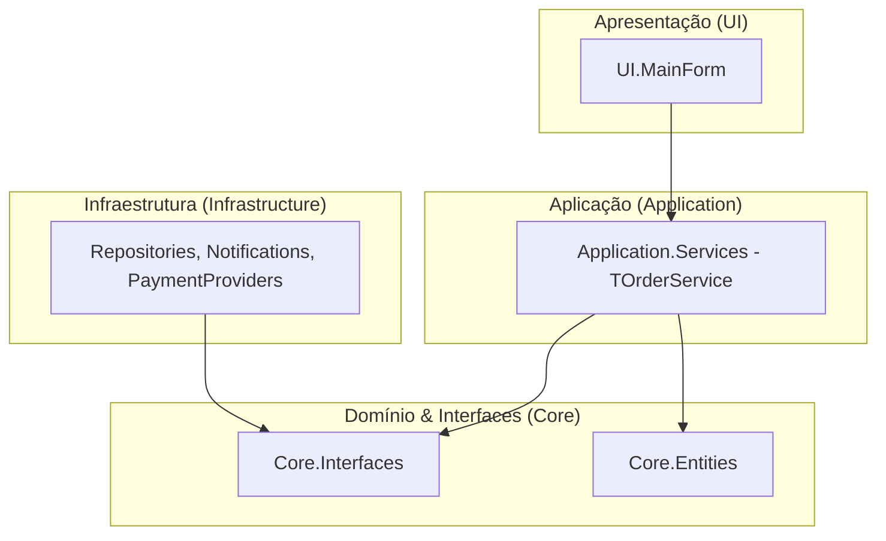
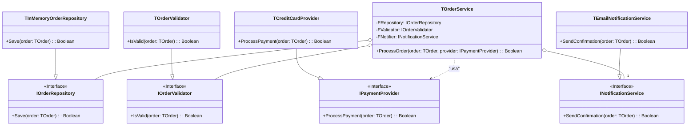
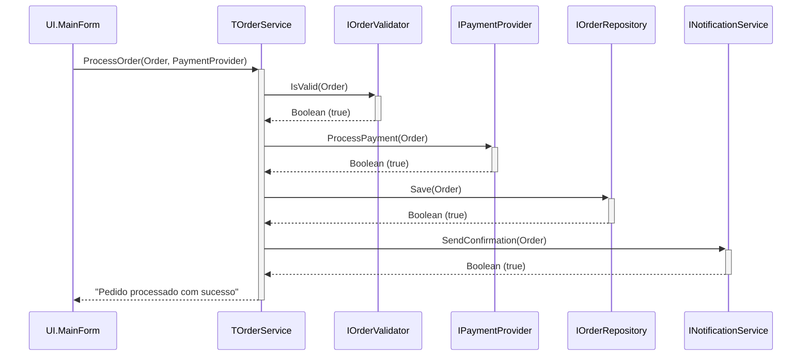
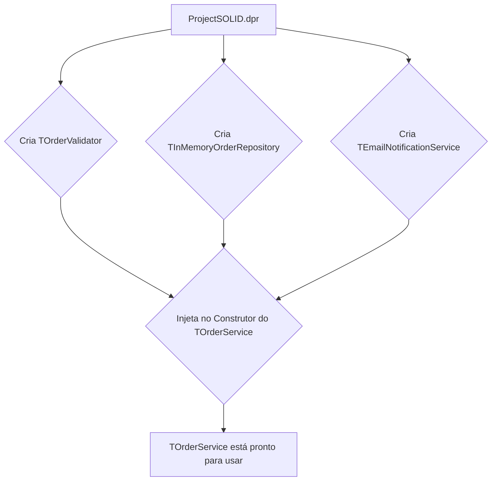
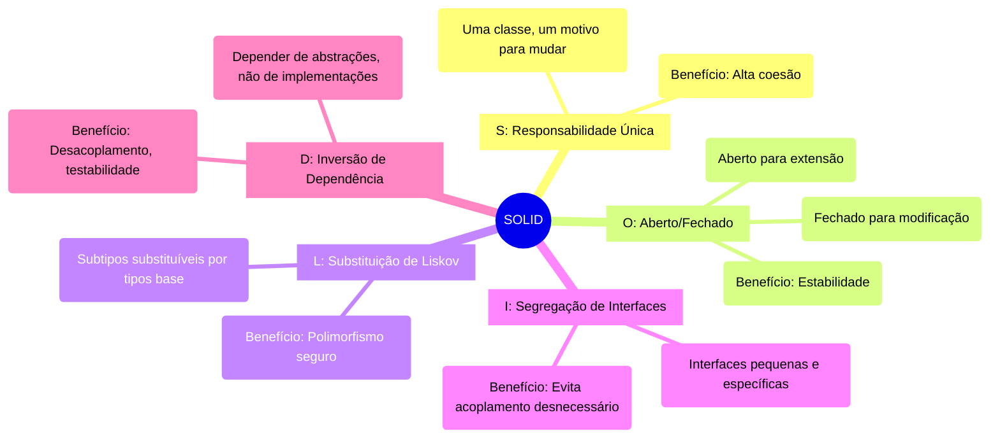

## Clean Code com Delphi 12.3 Athens


Este projeto é um guia prático e um exemplo de implementação dos princípios **SOLID** e **Clean Code** utilizando a versão mais recente do **Delphi 12.3 Athens**. O objetivo é demonstrar como criar aplicações robustas, manuteníveis, testáveis e escaláveis em Object Pascal moderno.

---

### 📚 Índice

1.  [Introdução ao Clean Code](#-introdução-ao-clean-code)
2.  [Recursos Modernos do Delphi 12.3 Athens](#-recursos-modernos-do-delphi-123-athens)
3.  [Estrutura do Projeto](#-estrutura-do-projeto)
4.  [Arquitetura do Sistema](#-arquitetura-do-sistema)
    *   [Diagrama de Arquitetura em Camadas](#-diagrama-de-arquitetura-em-camadas)
    *   [Diagrama de Classes UML](#-diagrama-de-classes-uml)
    *   [Diagrama de Sequência do Processamento](#-diagrama-de-sequência-do-processamento)
    *   [Diagrama de Injeção de Dependência](#-diagrama-de-injeção-de-dependência)
5.  [Os 5 Princípios SOLID](#-os-5-princípios-solid)
    *   [Mindmap dos Princípios SOLID](#-mindmap-dos-princípios-solid)
    *   [1. Single Responsibility Principle (SRP)](#1-single-responsibility-principle-srp)
    *   [2. Open/Closed Principle (OCP)](#2-openclosed-principle-ocp)
    *   [3. Liskov Substitution Principle (LSP)](#3-liskov-substitution-principle-lsp)
    *   [4. Interface Segregation Principle (ISP)](#4-interface-segregation-principle-isp)
    *   [5. Dependency Inversion Principle (DIP)](#5-dependency-inversion-principle-dip)
6.  [Pré-requisitos e Instalação](#-pré-requisitos-e-instalação)
7.  [Executando o Projeto e os Testes](#-executando-o-projeto-e-os-testes)
8.  [Benefícios da Arquitetura Limpa](#-benefícios-da-arquitetura-limpa)
9.  [Como Contribuir](#-como-contribuir)
10. [Licença](#-licença)
11. [Links Úteis e Referências](#-links-úteis-e-referências)

---

### ⭐ Introdução ao Clean Code

Clean Code (Código Limpo) não é apenas código que funciona; é código que é fácil de ler, entender e manter por outros desenvolvedores (ou por você mesmo no futuro). Um código limpo segue convenções, possui nomes significativos, funções pequenas e focadas, e uma arquitetura bem definida. Este projeto serve como um exemplo prático de como aplicar esses conceitos em Delphi.

### ✨ Recursos Modernos do Delphi 12.3 Athens

O Delphi 12.3 traz várias funcionalidades que facilitam a escrita de código limpo e moderno, todas aplicadas neste projeto:

*   **Inferência de Tipo com `var`**: Reduz a verbosidade na declaração de variáveis locais.
    ```pascal
    var Validator := TOrderValidator.Create; // O compilador infere o tipo
    ```
*   **Variáveis Inline**: Permite declarar variáveis no exato local onde são usadas, melhorando a legibilidade e o escopo.
    ```pascal
    if not FValidator.IsValid(AOrder, var ValidationErrors) then
      Exit(False);
    ```
*   **Managed Records**: Perfeitos para criar DTOs (Data Transfer Objects) e Entidades imutáveis sem o overhead de classes, com gerenciamento automático de memória.
    ```pascal
    // TOrderItem é um Managed Record em Core.Entities.pas
    var Item := TOrderItem.New('Delphi License', 1, 150.0);
    ```

### 📁 Estrutura do Projeto

A estrutura de diretórios foi organizada para separar claramente as responsabilidades, refletindo a arquitetura em camadas.

```
/CleanCodeDelphi/
├── ProjectSOLID.dpr                    // Arquivo principal do projeto e ponto de injeção de dependência
├── Core/
│   ├── Core.Interfaces.pas             // Contratos (interfaces) da aplicação
│   └── Core.Entities.pas               // Entidades de domínio (TOrder, TOrderItem)
├── Application/
│   ├── Application.Services.pas        // Orquestração e lógica de aplicação (TOrderService)
│   └── Application.Validators.pas      // Implementação da validação de regras de negócio
├── Infrastructure/
│   ├── Infrastructure.Repositories.pas // Implementação de repositórios (TInMemoryOrderRepository)
│   ├── Infrastructure.Notifications.pas// Implementação de notificações (TEmailNotificationService)
│   └── Infrastructure.PaymentProviders.pas // Implementação de provedores de pagamento
├── UI/
│   ├── UI.MainForm.pas                 // Camada de apresentação (formulário principal)
│   └── UI.MainForm.dfm                 // Design do formulário
└── Tests/
    ├── Tests.OrderService.pas          // Testes unitários para TOrderService
    └── Tests.Mocks.pas                 // Mocks das dependências para testes isolados
```

### 🏗️ Arquitetura do Sistema

A arquitetura do projeto é baseada em camadas e no princípio da inversão de dependência, garantindo baixo acoplamento e alta coesão.

#### ⭐ Diagrama de Arquitetura em Camadas

Este diagrama mostra a separação de responsabilidades e a direção das dependências (setas apontam para quem é conhecido). A camada UI depende da camada de Aplicação, que por sua vez depende apenas das Interfaces do Core. As implementações da Infraestrutura dependem das mesmas interfaces.



#### ⭐ Diagrama de Classes UML

Este diagrama ilustra a relação entre as abstrações (interfaces) e suas implementações concretas. O `TOrderService` depende das interfaces, não das classes concretas.



#### ⭐ Diagrama de Sequência do Processamento

O diagrama a seguir detalha o fluxo de uma chamada para processar um pedido.



#### ⭐ Diagrama de Injeção de Dependência

Ilustra como as dependências são "injetadas" no `TOrderService` através do construtor, centralizado no arquivo `.dpr`.



### 🧠 Os 5 Princípios SOLID

#### ⭐ Mindmap dos Princípios SOLID



---

#### 1. Single Responsibility Principle (SRP)
*Uma classe deve ter um, e apenas um, motivo para mudar.*

No nosso projeto, cada classe tem uma tarefa bem definida:
*   **`TOrder`**: Apenas contém os dados do pedido. Sua responsabilidade é representar a entidade Pedido.
*   **`TOrderValidator`**: Sua única responsabilidade é validar as regras de negócio de um pedido.
*   **`TInMemoryOrderRepository`**: Sua única responsabilidade é persistir o pedido (neste caso, em memória).
*   **`TEmailNotificationService`**: Sua única responsabilidade é enviar uma notificação de confirmação.

#### 2. Open/Closed Principle (OCP)
*Objetos ou entidades devem ser abertos para extensão, mas fechados para modificação.*

O melhor exemplo no projeto é o sistema de pagamento. `TOrderService` não conhece os detalhes de `TCreditCardProvider` ou `TPixProvider`. Ele apenas trabalha com a interface `IPaymentProvider`.

Para adicionar uma nova forma de pagamento (Ex: PayPal), basta criar uma nova classe que implementa `IPaymentProvider`. **Nenhuma alteração é necessária em `TOrderService`**.

```pascal
// Código existente
type
  IPaymentProvider = interface
    ['{...}']
    function ProcessPayment(const AOrder: TOrder): Boolean;
    function GetName: string;
  end;

// Nova Extensão (novo arquivo, sem alterar código existente)
type
  TPayPalProvider = class(TInterfacedObject, IPaymentProvider)
  public
    function ProcessPayment(const AOrder: TOrder): Boolean;
    function GetName: string;
  end;
```

#### 3. Liskov Substitution Principle (LSP)
*Subtipos devem ser substituíveis por seus tipos base sem alterar a correção do programa.*

Todas as classes que implementam uma interface neste projeto (como `TCreditCardProvider` e `TPixProvider` implementando `IPaymentProvider`) respeitam este princípio. O `TOrderService` pode receber qualquer uma delas e o comportamento esperado (processar um pagamento) será mantido, sem quebrar a lógica da aplicação.

#### 4. Interface Segregation Principle (ISP)
*Clientes não devem ser forçados a depender de interfaces que não usam.*

Em vez de uma única interface "gigante" `IOrderOperations`, criamos interfaces pequenas e coesas para cada responsabilidade:
*   `IOrderValidator`
*   `IOrderRepository`
*   `IPaymentProvider`
*   `INotificationService`

Isso garante que uma classe que precisa apenas salvar um pedido (como um logger de auditoria, por exemplo) dependa apenas de `IOrderRepository`, e não seja forçada a conhecer métodos de validação ou pagamento.

#### 5. Dependency Inversion Principle (DIP)
*Módulos de alto nível não devem depender de módulos de baixo nível. Ambos devem depender de abstrações.*

Na prática, isso é alcançado com **Injeção de Dependência**. O módulo de alto nível `TOrderService` não cria suas próprias dependências (`TOrderValidator`, `TInMemoryOrderRepository`). Em vez disso, ele depende das abstrações (`IOrderValidator`, `IOrderRepository`) e as recebe via construtor.

*   **Ruim**: O serviço cria suas próprias dependências (acoplamento forte).
    ```pascal
    constructor TOrderService.Create;
    begin
      FRepository := TInMemoryOrderRepository.Create; // Acoplado!
      FValidator := TOrderValidator.Create; // Impossível de testar sem as classes concretas.
    end;
    ```

*   **Bom (implementado no projeto)**: As dependências são injetadas via construtor.
    ```pascal
    // Em Application.Services.pas
    type
      TOrderService = class(TInterfacedObject, IOrderService)
      private
        FValidator: IOrderValidator;
        FRepository: IOrderRepository;
        FNotifier: INotificationService;
      public
        constructor Create(const AValidator: IOrderValidator;
          const ARepository: IOrderRepository; const ANotifier: INotificationService);
      end;

    // Em ProjectSOLID.dpr, onde as dependências são montadas:
    begin
      Application.Initialize;
      var Validator: IOrderValidator := TOrderValidator.Create;
      var Repository: IOrderRepository := TInMemoryOrderRepository.Create;
      var Notifier: INotificationService := TEmailNotificationService.Create;
      var OrderService: IOrderService := TOrderService.Create(Validator, Repository, Notifier); // Injetando

      Application.CreateForm(TfrmMain, frmMain);
      frmMain.SetOrderService(OrderService); // Passando o serviço para o formulário
      Application.Run;
    end.
    ```

### 🔧 Pré-requisitos e Instalação

1.  **Delphi 12.3 Athens**: É necessário ter o RAD Studio 12.3 ou Delphi 12.3 instalado.
2.  **DUnitX**: Para rodar os testes unitários (geralmente incluído no Delphi).

**Passos para Instalação:**
1.  Clone o repositório: `git clone https://github.com/your-username/CleanCodeDelphi.git`
2.  Abra o arquivo `ProjectSOLID.dproj` no Delphi 12.3.
3.  Compile o projeto (Shift + F9).

### 🚀 Executando o Projeto e os Testes

*   **Executar a Aplicação**: Pressione `F9` ou vá em `Run > Run`. Clique nos botões para simular o processamento de pedidos com diferentes formas de pagamento. O log na tela mostrará o fluxo de execução.
*   **Executar os Testes**:
    1.  No `Project Manager`, clique com o botão direito em `TestRunner.dpr` e selecione `Run`.
    2.  A janela do DUnitX aparecerá, executando todos os testes definidos em `Tests.OrderService.pas` e mostrando os resultados. Os testes usam *mocks* (`Tests.Mocks.pas`) para garantir que a lógica do `TOrderService` seja testada de forma isolada.

### 👍 Benefícios da Arquitetura Limpa

*   **Testabilidade**: A injeção de dependência permite substituir implementações reais por mocks, facilitando testes unitários rápidos e confiáveis.
*   **Manutenibilidade**: Código organizado, coeso e com baixo acoplamento é mais fácil de entender, corrigir e evoluir.
*   **Flexibilidade**: A troca de componentes (ex: mudar `TInMemoryOrderRepository` para um que usa FireDAC) se torna mais simples, afetando apenas a camada de infraestrutura.
*   **Escalabilidade**: A separação de responsabilidades permite que diferentes partes do sistema evoluam de forma independente.

### 🤝 Como Contribuir

Contribuições são muito bem-vindas! Se você deseja melhorar este projeto:

1.  Faça um **Fork** do repositório.
2.  Crie uma nova **Branch** para sua feature (`git checkout -b feature/AmazingFeature`).
3.  Faça o **Commit** de suas alterações (`git commit -m 'Add some AmazingFeature'`).
4.  Faça o **Push** para a Branch (`git push origin feature/AmazingFeature`).
5.  Abra um **Pull Request**.

### 📄 Licença

Este projeto está licenciado sob a Licença MIT.

### 🔗 Links Úteis e Referências

*   **Clean Code: A Handbook of Agile Software Craftsmanship** por Robert C. Martin.
*   **Documentação Oficial do Delphi**: [docwiki.embarcadero.com](https://docwiki.embarcadero.com/RADStudio/en/Main_Page)
*   **Blog da Embarcadero**: [blogs.embarcadero.com](https://blogs.embarcadero.com/)
*   **Repositório `delphi-books`**: [github.com/PacktPublishing/Delphi-Books](https://github.com/PacktPublishing/Delphi-Books)