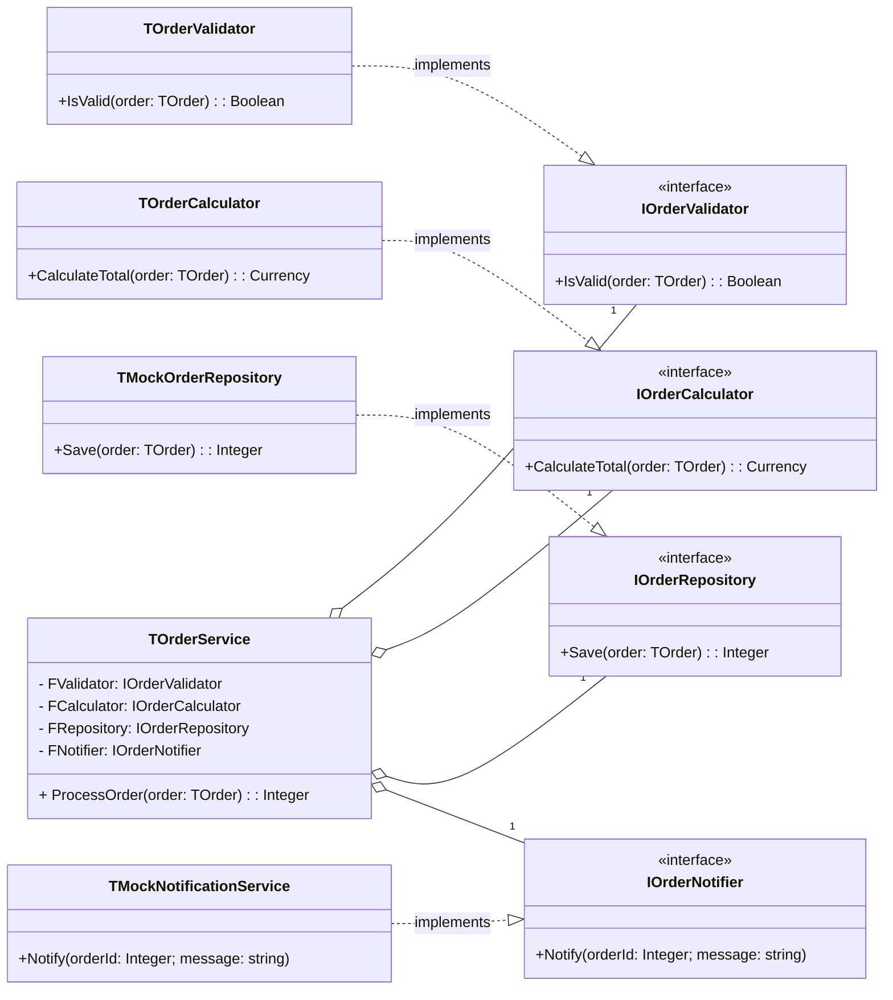
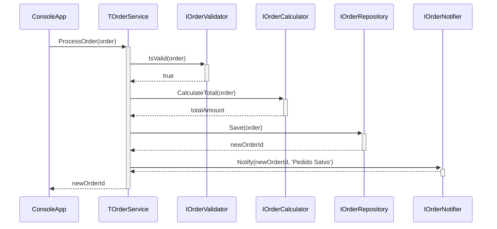

## 🚀 Clean Code & SOLID Principles in Delphi 12.3 Athens

[](https://www.embarcadero.com/products/delphi)
[](https://opensource.org/licenses/MIT)
[](https://en.wikipedia.org/wiki/SOLID)
[]()

Repositório de exemplo demonstrando a aplicação dos princípios **SOLID** e conceitos de **Clean Code** em um projeto **Delphi 12.3 Athens**. O objetivo é fornecer um guia prático e didático para desenvolvedores Delphi que desejam escrever um código mais limpo, manutenível e testável.

---

### 📚 Tabela de Conteúdos

1.  [Introdução: Por que Clean Code?](#-introdução-por-que-clean-code)
2.  [Recursos Modernos do Delphi 12.3](#-recursos-modernos-do-delphi-123-facilitando-o-clean-code)
3.  [Estrutura do Projeto](#-estrutura-do-projeto)
4.  [Arquitetura do Sistema](#-arquitetura-do-sistema)
    *   [Diagrama de Arquitetura em Camadas](#-diagrama-de-arquitetura-em-camadas)
    *   [Diagrama de Classes UML](#-diagrama-de-classes-uml)
    *   [Diagrama de Sequência do Processamento](#-diagrama-de-sequência-do-processamento)
    *   [Diagrama de Injeção de Dependência](#-diagrama-de-injeção-de-dependência)
5.  [Os 5 Princípios SOLID](#-os-5-princípios-solid)
    *   [Mindmap dos Princípios SOLID (Corrigido)](#-mindmap-dos-princípios-solid-corrigido)
    *   [S - Single Responsibility Principle (SRP)](#s---single-responsibility-principle-srp)
    *   [O - Open/Closed Principle (OCP)](#o---openclosed-principle-ocp)
    *   [L - Liskov Substitution Principle (LSP)](#l---liskov-substitution-principle-lsp)
    *   [I - Interface Segregation Principle (ISP)](#i---interface-segregation-principle-isp)
    *   [D - Dependency Inversion Principle (DIP)](#d---dependency-inversion-principle-dip)
6.  [Pré-requisitos](#-pré-requisitos)
7.  [Instalação e Configuração](#-instalação-e-configuração)
8.  [Como Executar o Projeto](#-como-executar-o-projeto)
9.  [Como Executar os Testes](#-como-executar-os-testes)
10. [Benefícios da Arquitetura Limpa](#-benefícios-da-arquitetura-limpa)
11. [Como Contribuir](#-como-contribuir)
12. [Licença](#-licença)
13. [Links Úteis e Referências](#-links-úteis-e-referências)

---

### 🎯 Introdução: Por que Clean Code?

Código limpo é um código que pode ser lido, entendido e modificado por qualquer desenvolvedor com facilidade. Ele é organizado, segue convenções e é construído sobre uma arquitetura sólida. Os princípios SOLID são a base para alcançar essa arquitetura. Este projeto materializa esses conceitos em um cenário prático: um serviço de processamento de pedidos.

### ✨ Recursos Modernos do Delphi 12.3 Facilitando o Clean Code

O Delphi 12.3 Athens introduz e aprimora recursos que tornam a escrita de código limpo mais natural:

*   **Inferência de Tipo com `var`**: Reduz a verbosidade na declaração de variáveis.
    ```pascal
    var Validator := TOrderValidator.Create; // O compilador infere o tipo
    ```
*   **Variáveis Inline**: Permite declarar variáveis no ponto de uso, melhorando a localidade e a legibilidade.
    ```pascal
    if AOrder.IsValid(var ValidationMessage: string) then
      // Usa ValidationMessage aqui
    ```
*   **Managed Records**: Perfeitos para DTOs (Data Transfer Objects) e Entidades, pois gerenciam seu próprio ciclo de vida, evitando vazamentos de memória e simplificando o código.
*   **Melhorias na Sintaxe**: Pequenas melhorias que tornam o código mais expressivo e menos propenso a erros.

### 📁 Estrutura do Projeto

A estrutura de pastas foi organizada para separar claramente as responsabilidades, facilitando a navegação e a manutenção.

```
/
├── CleanCodeDelphi.dpr
├── CleanCodeDelphi.dproj
├── README.md
└── src/
    ├── entities/
    │   └── OrderEntities.pas       // Contém TOrder e TOrderItem
    ├── exceptions/
    │   └── CustomExceptions.pas    // Exceções customizadas como EOrderValidationException
    ├── interfaces/
    │   └── OrderInterfaces.pas     // Contém todas as interfaces (IOrder*, etc.)
    ├── mocks/
    │   ├── MockNotificationService.pas // Implementação falsa para testes
    │   └── MockOrderRepository.pas   // Implementação falsa para testes
    ├── services/
    │   ├── OrderCalculator.pas     // Implementação de IOrderCalculator
    │   ├── OrderService.pas        // Orquestrador principal (TOrderService)
    │   └── OrderValidator.pas      // Implementação de IOrderValidator
    └── tests/
        └── TestOrderService.pas    // Testes unitários para TOrderService
```

### 🏛️ Arquitetura do Sistema

A arquitetura é projetada em torno da Inversão de Dependência, permitindo baixo acoplamento e alta coesão.

#### 🏗️ Diagrama de Arquitetura em Camadas

Este diagrama mostra como as dependências fluem apenas em uma direção, das camadas superiores para as inferiores, sempre dependendo de abstrações.

```mermaid
graph TD
    subgraph A[Apresentação]
        direction LR
        ConsoleApp(Console App)
    end

    subgraph B[Serviços/Orquestração]
        direction LR
        OrderService(TOrderService)
    end

    subgraph C[Abstrações (Interfaces)]
        direction LR
        IOrderValidator(IOrderValidator)
        IOrderCalculator(IOrderCalculator)
        IOrderRepository(IOrderRepository)
        IOrderNotifier(IOrderNotifier)
    end

    subgraph D[Domínio]
        direction LR
        Entities(TOrder, TOrderItem)
    end

    subgraph E[Infraestrutura/Implementações]
        direction LR
        ValidatorImpl(TOrderValidator)
        CalculatorImpl(TOrderCalculator)
        RepositoryImpl(TMockOrderRepository)
        NotifierImpl(TMockNotificationService)
    end

    ConsoleApp --> OrderService
    OrderService --> IOrderValidator
    OrderService --> IOrderCalculator
    OrderService --> IOrderRepository
    OrderService --> IOrderNotifier

    IOrderValidator -.-> ValidatorImpl
    IOrderCalculator -.-> CalculatorImpl
    IOrderRepository -.-> RepositoryImpl
    IOrderNotifier -.-> NotifierImpl

    OrderService --> Entities
    ValidatorImpl --> Entities

    classDef default fill:#f9f9f9,stroke:#333,stroke-width:2px;
    classDef layer fill:#E6E6FA,stroke:#9370DB,stroke-width:2px;
    class A,B,C,D,E layer;
```

#### 🔗 Diagrama de Classes UML

Este diagrama ilustra as relações entre as interfaces e suas implementações concretas e mocks.



#### ⚡ Diagrama de Sequência do Processamento

Mostra o fluxo de chamadas quando `TOrderService.ProcessOrder` é executado.



#### 🔄 Diagrama de Injeção de Dependência

Ilustra como as dependências são "injetadas" no `TOrderService` através do construtor.

```mermaid
graph TD
    subgraph CompositionRoot [Ponto de Criação (Main)]
        Validator(TOrderValidator)
        Calculator(TOrderCalculator)
        Repository(TMockOrderRepository)
        Notifier(TMockNotificationService)
    end

    subgraph ServiceLayer [Camada de Serviço]
        OrderService("TOrderService.Create(...)")
    end

    Validator --> OrderService
    Calculator --> OrderService
    Repository --> OrderService
    Notifier --> OrderService

    OrderService -->|usa| IValidator(IOrderValidator)
    OrderService -->|usa| ICalculator(IOrderCalculator)
    OrderService -->|usa| IRepository(IOrderRepository)
    OrderService -->|usa| INotifier(IOrderNotifier)

    classDef dep fill:#D4F8E8,stroke:#006400;
    class Validator,Calculator,Repository,Notifier dep;
```

---

### 🧠 Os 5 Princípios SOLID

SOLID é um acrônimo para cinco princípios de design que visam tornar o software mais compreensível, flexível e manutenível.

#### ⭐ Mindmap dos Princípios SOLID (Corrigido)

Este mindmap visual resume os cinco princípios, seus conceitos e benefícios.

```mermaid
mindmap
  root((SOLID Principles))
    S(Single Responsibility)
      "Um módulo, uma razão para mudar"
      Benefícios
        "Menor acoplamento"
        "Maior coesão"
      Exemplo
        "TOrderValidator só valida"
        "TOrderCalculator só calcula"
      Violação
        "Classe que busca, valida e salva dados"
    O(Open/Closed)
      "Aberto para extensão,"
      "fechado para modificação"
      Benefícios
        "Estabilidade do código"
        "Novas features sem quebrar o existente"
      Exemplo
        "Adicionar novo `ICalculator` sem"
        "mudar `TOrderService`"
      Violação
        "`case` ou `if/else` gigante"
        "para tratar subtipos"
    L(Liskov Substitution)
      "Subtipos devem ser substituíveis"
      "por seus tipos base"
      Benefícios
        "Hierarquias de classes confiáveis"
        "Polimorfismo seguro"
      Exemplo
        "Qualquer `IOrderRepository` (real ou mock)"
        "funciona com `TOrderService`"
      Violação
        "Método da classe filha que"
        "lança `NotImplemented`"
    I(Interface Segregation)
      "Muitas interfaces específicas"
      "são melhores que uma geral"
      Benefícios
        "Clientes não dependem de métodos que não usam"
        "Reduz acoplamento"
      Exemplo
        "`IOrderNotifier` e `IOrderRepository`"
        "são interfaces separadas"
      Violação
        "Classe que implementa interface"
        "e lança exceções para métodos não usados"
    D(Dependency Inversion)
      "Módulos de alto nível não devem depender"
      "de baixo nível. Ambos dependem de abstrações."
      Benefícios
        "Inversão de Controle (IoC)"
        "Facilita testes e mocks"
      Exemplo
        "`TOrderService` depende de `IOrderRepository`,"
        "não de `TMockOrderRepository`"
      Violação
        "Classe de serviço instanciando"
        "uma classe de acesso a dados (`TFDQuery`)"
        "diretamente dentro de um método"
```

#### S - Single Responsibility Principle (SRP)

> Uma classe deve ter apenas uma razão para mudar.

*   **Aplicação**: `TOrderValidator` tem a única responsabilidade de validar um pedido. `TOrderCalculator` tem a única responsabilidade de calcular o total. `TOrderService` orquestra o processo, mas não conhece os detalhes da validação ou do cálculo.

```pascal
// Em OrderValidator.pas
type
  TOrderValidator = class(TInterfacedObject, IOrderValidator)
  public
    function IsValid(const AOrder: TOrder): Boolean;
  end;

// Em OrderCalculator.pas
type
  TOrderCalculator = class(TInterfacedObject, IOrderCalculator)
  public
    function CalculateTotal(const AOrder: TOrder): Currency;
  end;
```

#### O - Open/Closed Principle (OCP)

> Entidades de software devem ser abertas para extensão, mas fechadas para modificação.

*   **Aplicação**: Se precisarmos de uma nova regra de cálculo (ex: para clientes premium), podemos criar uma nova classe `TPremiumOrderCalculator` que implementa `IOrderCalculator` e injetá-la no `TOrderService` sem alterar uma linha de código do `TOrderService`.

#### L - Liskov Substitution Principle (LSP)

> Subtipos devem ser substituíveis por seus tipos base sem alterar a corretude do programa.

*   **Aplicação**: `TOrderService` funciona com qualquer classe que implemente `IOrderRepository`. Podemos passar uma `TMockOrderRepository` (para testes) ou uma `TDatabaseOrderRepository` (para produção) e o serviço funcionará da mesma forma.

```pascal
// Em TestOrderService.pas (usando o mock)
FOrderService := TOrderService.Create(FValidator, FCalculator, TMockOrderRepository.Create, FNotifier);

// Em CleanCodeDelphi.dpr (usando uma implementação real, se existisse)
var OrderService := TOrderService.Create(Validator, Calculator, TDatabaseOrderRepository.Create, Notifier);
```

#### I - Interface Segregation Principle (ISP)

> Clientes não devem ser forçados a depender de interfaces que não usam.

*   **Aplicação**: Em vez de uma única interface `IOrderManager` com métodos `Validate`, `Calculate`, `Save` e `Notify`, criamos quatro interfaces distintas (`IOrderValidator`, `IOrderCalculator`, `IOrderRepository`, `IOrderNotifier`). Isso permite que as classes implementem apenas o que precisam.

#### D - Dependency Inversion Principle (DIP)

> Módulos de alto nível não devem depender de módulos de baixo nível. Ambos devem depender de abstrações.

*   **Aplicação**: Este é o princípio central da nossa arquitetura. `TOrderService` (alto nível) não depende diretamente de `TOrderValidator` ou `TMockOrderRepository` (baixo nível). Ele depende das abstrações `IOrderValidator` e `IOrderRepository`. As implementações concretas são "injetadas" de fora.

```pascal
// Construtor do TOrderService
constructor TOrderService.Create(const AValidator: IOrderValidator;
  const ACalculator: IOrderCalculator; const ARepository: IOrderRepository;
  const ANotifier: IOrderNotifier);
begin
  FValidator := AValidator;
  FCalculator := ACalculator;
  FRepository := ARepository;
  FNotifier := ANotifier;
end;
```

---

### 🔧 Pré-requisitos

*   **Embarcadero Delphi 12.3 Athens** (ou superior).
*   **Test DUnitX Framework**: Usado para os testes unitários. Pode ser instalado via **GetIt Package Manager**.

### ⚙️ Instalação e Configuração

1.  **Clone o repositório:**
    ```bash
    git clone https://github.com/seu-usuario/CleanCodeDelphi.git
    ```
2.  **Abra o Delphi 12.3**.
3.  **Instale o DUnitX**:
    *   Vá em `Tools > GetIt Package Manager`.
    *   Procure por `DUnitX`.
    *   Clique em `Install`.
4.  **Abra o projeto**:
    *   Vá em `File > Open Project...`.
    *   Navegue até a pasta clonada e abra o arquivo `CleanCodeDelphi.dproj`.
5.  **Compile o projeto**: Pressione `Ctrl + F9` para garantir que todas as dependências estão corretas.

### ▶️ Como Executar o Projeto

1.  Abra o arquivo `CleanCodeDelphi.dpr`.
2.  Pressione `F9` ou clique em `Run > Run`.
3.  O console irá exibir a saída do processamento do pedido de exemplo.

### ✅ Como Executar os Testes

1.  No `Project Manager`, clique com o botão direito em `TestOrderService.exe`.
2.  Selecione `Run`.
3.  O console do DUnitX será exibido com os resultados dos testes. Todos os testes devem passar.

### 🏆 Benefícios da Arquitetura Limpa

*   **Manutenibilidade**: Código fácil de entender e modificar.
*   **Testabilidade**: A Injeção de Dependência permite mockar componentes para testes unitários isolados.
*   **Flexibilidade**: Novas funcionalidades podem ser adicionadas com impacto mínimo no código existente.
*   **Reusabilidade**: Componentes desacoplados podem ser reutilizados em outros projetos.
*   **Escalabilidade**: A arquitetura suporta o crescimento do projeto de forma organizada.

### 🤝 Como Contribuir

Contribuições são bem-vindas! Se você tiver sugestões, melhorias ou encontrar um bug:

1.  Faça um **Fork** do projeto.
2.  Crie uma nova **Branch** (`git checkout -b feature/sua-feature`).
3.  Faça o **Commit** das suas alterações (`git commit -m 'Adiciona nova feature'`).
4.  Faça o **Push** para a Branch (`git push origin feature/sua-feature`).
5.  Abra um **Pull Request**.

### 📜 Licença

Este projeto está licenciado sob a Licença MIT. Veja o arquivo `LICENSE` para mais detalhes.

### 🔗 Links Úteis e Referências

*   **Clean Code: A Handbook of Agile Software Craftsmanship** - Robert C. Martin
*   **Documentação do Delphi 12 Athens** - Embarcadero
*   **Refactoring Guru** - Padrões de Projeto e Princípios SOLID