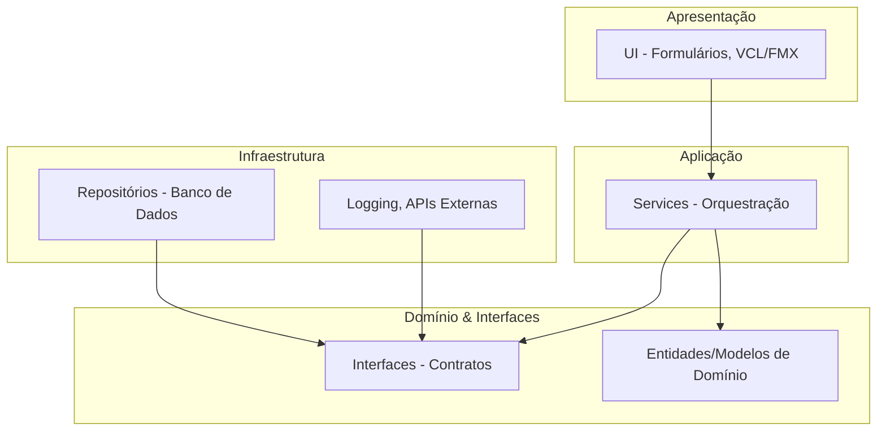
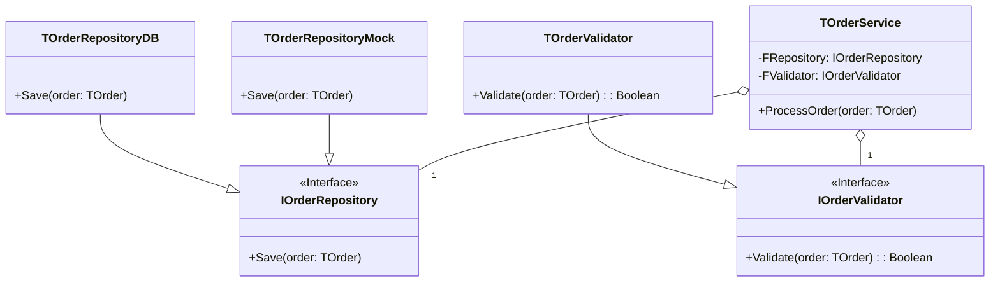
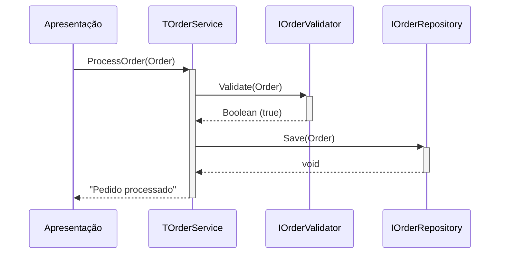
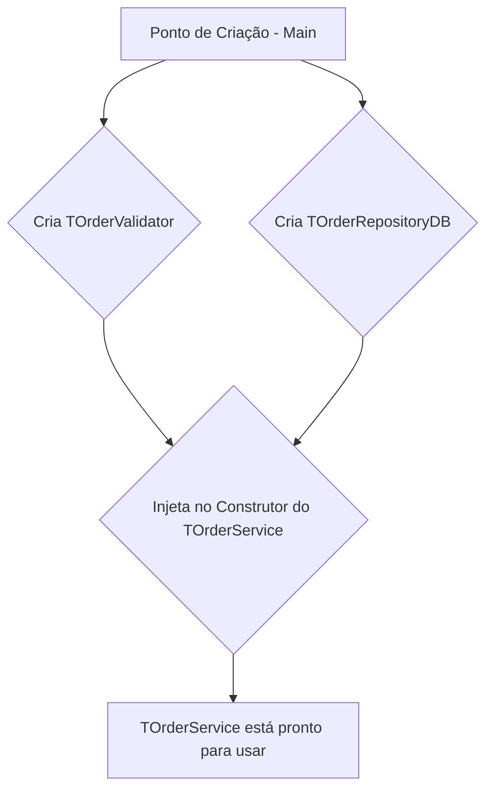
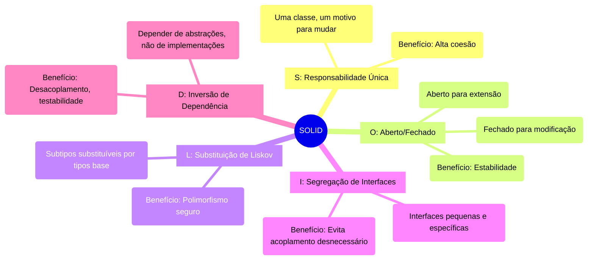

## Clean Code com Delphi 12.3 Athens


Este projeto é um guia prático e um exemplo de implementação dos princípios **SOLID** e **Clean Code** utilizando a versão mais recente do **Delphi 12.3 Athens**. O objetivo é demonstrar como criar aplicações robustas, manuteníveis, testáveis e escaláveis em Object Pascal moderno.

---

### 📚 Índice

1.  [Introdução ao Clean Code](#-introdução-ao-clean-code)
2.  [Recursos Modernos do Delphi 12.3 Athens](#-recursos-modernos-do-delphi-123-athens)
3.  [Estrutura do Projeto](#-estrutura-do-projeto)
4.  [Arquitetura do Sistema](#-arquitetura-do-sistema)
    *   [Diagrama de Arquitetura em Camadas](#-diagrama-de-arquitetura-em-camadas)
    *   [Diagrama de Classes UML](#-diagrama-de-classes-uml)
    *   [Diagrama de Sequência do Processamento](#-diagrama-de-sequência-do-processamento)
    *   [Diagrama de Injeção de Dependência](#-diagrama-de-injeção-de-dependência)
5.  [Os 5 Princípios SOLID](#-os-5-princípios-solid)
    *   [Mindmap dos Princípios SOLID](#-mindmap-dos-princípios-solid-corrigido)
    *   [1. Single Responsibility Principle (SRP)](#1-single-responsibility-principle-srp)
    *   [2. Open/Closed Principle (OCP)](#2-openclosed-principle-ocp)
    *   [3. Liskov Substitution Principle (LSP)](#3-liskov-substitution-principle-lsp)
    *   [4. Interface Segregation Principle (ISP)](#4-interface-segregation-principle-isp)
    *   [5. Dependency Inversion Principle (DIP)](#5-dependency-inversion-principle-dip)
6.  [Pré-requisitos e Instalação](#-pré-requisitos-e-instalação)
7.  [Executando o Projeto e os Testes](#-executando-o-projeto-e-os-testes)
8.  [Benefícios da Arquitetura Limpa](#-benefícios-da-arquitetura-limpa)
9.  [Como Contribuir](#-como-contribuir)
10. [Licença](#-licença)
11. [Links Úteis e Referências](#-links-úteis-e-referências)

---

### ⭐ Introdução ao Clean Code

Clean Code (Código Limpo) não é apenas código que funciona; é código que é fácil de ler, entender e manter por outros desenvolvedores (ou por você mesmo no futuro). Um código limpo segue convenções, possui nomes significativos, funções pequenas e focadas, e uma arquitetura bem definida. Este projeto serve como um exemplo prático de como aplicar esses conceitos em Delphi.

### ✨ Recursos Modernos do Delphi 12.3 Athens

O Delphi 12.3 traz várias funcionalidades que facilitam a escrita de código limpo e moderno:

*   **Inferência de Tipo com `var`**: Reduz a verbosidade na declaração de variáveis locais.
    ```pascal
    var Validator := TOrderValidator.Create; // O compilador infere o tipo
    ```
*   **Variáveis Inline**: Permite declarar variáveis no exato local onde são usadas, melhorando a legibilidade e o escopo.
    ```pascal
    if AOrder.IsValid(var ValidationMessage: string) then
      ShowMessage('Válido')
    else
      ShowMessage(ValidationMessage);
    ```
*   **Managed Records**: Perfeitos para criar DTOs (Data Transfer Objects) e Entidades imutáveis sem o overhead de classes, com gerenciamento automático de memória.

### 📁 Estrutura do Projeto

A estrutura de diretórios foi organizada para separar claramente as responsabilidades, facilitando a navegação e a manutenção.

```
/CleanCodeDelphi/
├── Source/
│   ├── Core/
│   │   ├── Core.Domain.pas         // Entidades e exceções do domínio
│   │   └── Core.Interfaces.pas     // Contratos (interfaces) da aplicação
│   ├── Infrastructure/
│   │   ├── Infrastructure.Data.pas // Implementação de repositórios (banco de dados, etc.)
│   │   └── Infrastructure.Logging.pas// Implementação de log
│   ├── Application/
│   │   └── Application.Services.pas  // Orquestração e lógica de aplicação (Services)
│   └── Presentation/
│       └── UI.Main.pas             // Camada de apresentação (formulário principal)
├── Tests/
│   ├── Tests.Domain.pas          // Testes unitários para o domínio
│   └── Tests.Application.pas     // Testes unitários para os serviços
└── CleanCodeDelphi.dpr             // Arquivo principal do projeto
```

### 🏗️ Arquitetura do Sistema

A arquitetura do projeto é baseada em camadas e no princípio da inversão de dependência, garantindo baixo acoplamento e alta coesão.

#### ⭐ Diagrama de Arquitetura em Camadas

Este diagrama mostra a separação de responsabilidades e a direção das dependências (setas apontam para quem é conhecido). A camada de apresentação conhece a camada de aplicação, que conhece as interfaces, mas não as implementações da infraestrutura.



#### ⭐ Diagrama de Classes UML

Este diagrama ilustra a relação entre as abstrações (interfaces) e suas implementações concretas. O `TOrderService` depende das interfaces, não das classes concretas.



#### ⭐ Diagrama de Sequência do Processamento

O diagrama a seguir detalha o fluxo de uma chamada para processar um pedido.



#### ⭐ Diagrama de Injeção de Dependência

Ilustra como as dependências são "injetadas" no `TOrderService` através do construtor.



### 🧠 Os 5 Princípios SOLID

SOLID é um acrônimo para cinco princípios de design que visam tornar o software mais compreensível, flexível e manutenível.

#### ⭐ Mindmap dos Princípios SOLID (Corrigido)

Este mindmap visual resume os cinco princípios, seus conceitos e benefícios.



---

#### 1. Single Responsibility Principle (SRP)
*Uma classe deve ter um, e apenas um, motivo para mudar.*

Isso significa que uma classe deve ter apenas uma responsabilidade ou tarefa.

*   **Ruim**: Uma classe `TOrder` que valida, calcula e salva a si mesma.
    ```pascal
    type
      TOrder = class
      public
        // Propriedades do pedido
        function Validate: Boolean;   // Responsabilidade 1
        procedure CalculateTotal;    // Responsabilidade 2
        procedure SaveToDatabase;    // Responsabilidade 3
      end;
    ```

*   **Bom**: Separação das responsabilidades em classes distintas.
    ```pascal
    type
      TOrder = class // Apenas dados
        // Propriedades do pedido
      end;

      TOrderValidator = class // Apenas validação
      public
        function IsValid(AOrder: TOrder): Boolean;
      end;

      TOrderCalculator = class // Apenas cálculo
      public
        function CalculateTotal(AOrder: TOrder): Currency;
      end;

      TOrderRepository = class // Apenas persistência
      public
        procedure Save(AOrder: TOrder);
      end;
    ```

#### 2. Open/Closed Principle (OCP)
*Objetos ou entidades devem ser abertos para extensão, mas fechados para modificação.*

Isso significa que você deve ser capaz de adicionar um novo comportamento sem alterar o código-fonte existente.

*   **Ruim**: Um `case` ou `if/else` para diferentes tipos de desconto. Adicionar um novo desconto exige modificar esta função.
    ```pascal
    function TOrderCalculator.CalculateDiscount(ADiscountType: TDiscountType): Currency;
    begin
      case ADiscountType of
        dtStudent: Result := FTotal * 0.1;
        dtSenior: Result := FTotal * 0.15;
        // Se um novo desconto (dtVIP) for adicionado, este código precisa ser alterado.
      end;
    end;
    ```

*   **Bom**: Usar uma estratégia (Strategy Pattern) com interfaces.
    ```pascal
    type
      IDiscountStrategy = interface
        ['{GUID}']
        function Calculate(ATotal: Currency): Currency;
      end;

      TStudentDiscount = class(TInterfacedObject, IDiscountStrategy)
      public
        function Calculate(ATotal: Currency): Currency;
      end;

      TSeniorDiscount = class(TInterfacedObject, IDiscountStrategy)
      public
        function Calculate(ATotal: Currency): Currency;
      end;

    // Para adicionar um novo desconto, basta criar uma nova classe. O código original não é tocado.
    var
      LDiscount: IDiscountStrategy;
    begin
      LDiscount := TStudentDiscount.Create;
      FinalPrice := Total - LDiscount.Calculate(Total);
    end;
    ```

#### 3. Liskov Substitution Principle (LSP)
*Subtipos devem ser substituíveis por seus tipos base sem alterar a correção do programa.*

Se a classe `S` é um subtipo da classe `T`, então objetos do tipo `T` devem poder ser substituídos por objetos do tipo `S` sem quebrar a aplicação.

*   **Ruim**: Uma classe filha que quebra o contrato da classe pai.
    ```pascal
    type
      TRectangle = class
      public
        procedure SetWidth(AValue: Integer); virtual;
        procedure SetHeight(AValue: Integer); virtual;
      end;

      TSquare = class(TRectangle) // Quadrado é um retângulo?
      public
        procedure SetWidth(AValue: Integer); override; // Viola o LSP
        procedure SetHeight(AValue: Integer); override; // Viola o LSP
      end;

    procedure TSquare.SetWidth(AValue: Integer);
    begin
      inherited SetWidth(AValue);
      inherited SetHeight(AValue); // Efeito colateral: altera a altura também
    end;
    ```
    Um teste que usa `TRectangle` pode falhar se receber um `TSquare`.

*   **Bom**: Evitar heranças que mudam o comportamento fundamental. Prefira composição ou hierarquias mais seguras. Neste caso, `TRectangle` e `TSquare` poderiam herdar de uma classe `TShape` abstrata, mas não um do outro.

#### 4. Interface Segregation Principle (ISP)
*Clientes não devem ser forçados a depender de interfaces que não usam.*

É melhor ter muitas interfaces específicas do que uma única interface genérica.

*   **Ruim**: Uma interface "faz-tudo".
    ```pascal
    type
      IWorker = interface
        ['{GUID}']
        procedure Work;
        procedure Eat;
      end;

    type
      TRobot = class(TInterfacedObject, IWorker)
      public
        procedure Work; // OK
        procedure Eat;  // Um robô não come. Método vazio ou exceção.
      end;
    ```

*   **Bom**: Interfaces segregadas.
    ```pascal
    type
      IWorkable = interface
        ['{GUID}']
        procedure Work;
      end;

      IEatable = interface
        ['{GUID}']
        procedure Eat;
      end;

    type
      THuman = class(TInterfacedObject, IWorkable, IEatable) ... end;
      TRobot = class(TInterfacedObject, IWorkable) ... end; // Implementa apenas o que precisa.
    ```

#### 5. Dependency Inversion Principle (DIP)
*Módulos de alto nível não devem depender de módulos de baixo nível. Ambos devem depender de abstrações.*
*Abstrações não devem depender de detalhes. Detalhes devem depender de abstrações.*

Na prática, isso significa que devemos depender de interfaces, não de classes concretas.

*   **Ruim**: O serviço cria suas próprias dependências (acoplamento forte).
    ```pascal
    type
      TOrderService = class
      private
        FRepository: TOrderRepositoryDB; // Depende da classe concreta
      public
        constructor Create;
        procedure ProcessOrder(AOrder: TOrder);
      end;

    constructor TOrderService.Create;
    begin
      FRepository := TOrderRepositoryDB.Create; // Acoplado! Impossível de testar sem o banco de dados.
    end;
    ```

*   **Bom**: As dependências são injetadas via construtor (Injeção de Dependência).
    ```pascal
    type
      TOrderService = class
      private
        FRepository: IOrderRepository; // Depende da abstração (interface)
      public
        constructor Create(ARepository: IOrderRepository);
        procedure ProcessOrder(AOrder: TOrder);
      end;

    constructor TOrderService.Create(ARepository: IOrderRepository);
    begin
      FRepository := ARepository; // A dependência é recebida, não criada.
    end;

    // No ponto de entrada da aplicação (Main):
    var
      Service: TOrderService;
      Repository: IOrderRepository;
    begin
      Repository := TOrderRepositoryDB.Create; // Implementação real
      Service := TOrderService.Create(Repository);

      // Em um teste unitário:
      Repository := TOrderRepositoryMock.Create; // Implementação de teste (mock)
      Service := TOrderService.Create(Repository);
    end;
    ```

### 🔧 Pré-requisitos e Instalação

1.  **Delphi 12.3 Athens**: É necessário ter o RAD Studio 12.3 ou Delphi 12.3 instalado.
2.  **Dependências**: Este projeto pode utilizar dependências gerenciadas via `Boss` ou `GetIt Package Manager`.
    *   `TestInsight`: Framework para testes unitários.

**Passos para Instalação:**
1.  Clone o repositório: `git clone https://github.com/your-username/CleanCodeDelphi.git`
2.  Abra o arquivo `CleanCodeDelphi.dproj` no Delphi 12.3.
3.  Instale as dependências via GetIt, se necessário.
4.  Compile o projeto (Shift + F9).

### 🚀 Executando o Projeto e os Testes

*   **Executar a Aplicação**: Pressione `F9` ou vá em `Run > Run` no IDE do Delphi.
*   **Executar os Testes**:
    1.  Compile o projeto de testes.
    2.  Se estiver usando TestInsight, abra a janela do TestInsight no IDE.
    3.  Clique em `Run All` para executar todos os testes unitários. Os testes garantem que a lógica de domínio e aplicação funciona como esperado, de forma isolada.

### 👍 Benefícios da Arquitetura Limpa

*   **Testabilidade**: A injeção de dependência permite substituir implementações reais por mocks, facilitando testes unitários rápidos e confiáveis.
*   **Manutenibilidade**: Código organizado, coeso e com baixo acoplamento é mais fácil de entender, corrigir e evoluir.
*   **Flexibilidade**: A troca de componentes (ex: mudar de um banco de dados SQL para um NoSQL) se torna mais simples, pois afeta apenas a camada de infraestrutura.
*   **Escalabilidade**: A separação de responsabilidades permite que diferentes partes do sistema evoluam de forma independente.

### 🤝 Como Contribuir

Contribuições são muito bem-vindas! Se você deseja melhorar este projeto:

1.  Faça um **Fork** do repositório.
2.  Crie uma nova **Branch** para sua feature (`git checkout -b feature/AmazingFeature`).
3.  Faça o **Commit** de suas alterações (`git commit -m 'Add some AmazingFeature'`).
4.  Faça o **Push** para a Branch (`git push origin feature/AmazingFeature`).
5.  Abra um **Pull Request**.

### 📄 Licença

Este projeto está licenciado sob a Licença MIT. Veja o arquivo `LICENSE` para mais detalhes.

### 🔗 Links Úteis e Referências

*   **Clean Code: A Handbook of Agile Software Craftsmanship** por Robert C. Martin.
*   **Documentação Oficial do Delphi**: [docwiki.embarcadero.com](https://docwiki.embarcadero.com/RADStudio/en/Main_Page)
*   **Blog da Embarcadero**: [blogs.embarcadero.com](https://blogs.embarcadero.com/)
*   **Repositório `delphi-books`**: [github.com/PacktPublishing/Delphi-Books](https://github.com/PacktPublishing/Delphi-Books)