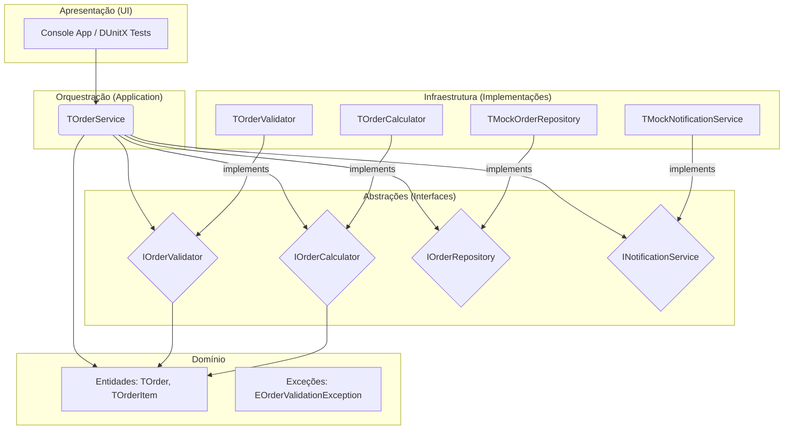
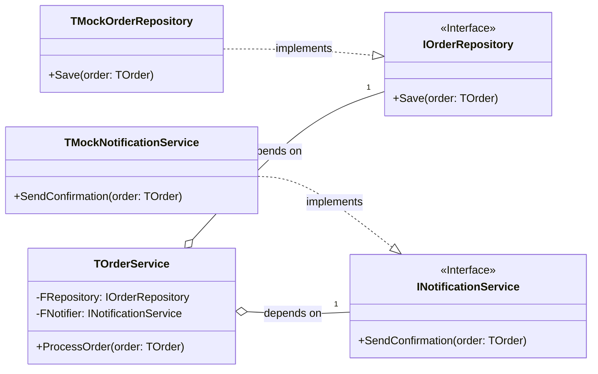
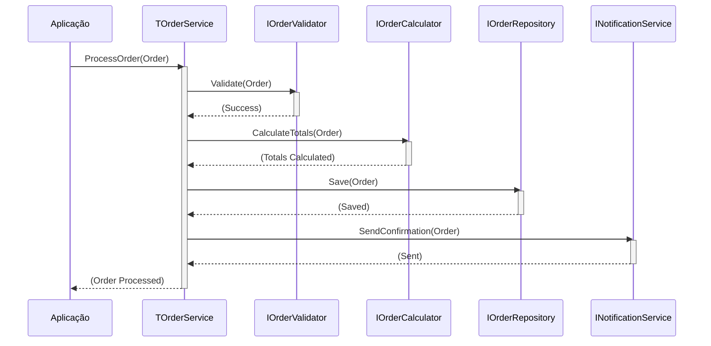

## README.md: Clean Code e SOLID com Delphi 12.3 Athens


Um projeto de referência completo demonstrando a aplicação dos princípios **SOLID** e de **Clean Code** utilizando os recursos modernos do **Delphi 12.3 Athens**. O objetivo é fornecer um guia prático e didático para a construção de software robusto, manutenível e testável em Object Pascal.

---

### 📚 Tabela de Conteúdos

1.  [🎯 Introdução](#-introdução)
2.  [✨ Recursos Modernos do Delphi 12.3 para Clean Code](#-recursos-modernos-do-delphi-123-para-clean-code)
3.  [🏗️ Arquitetura do Sistema](#️-arquitetura-do-sistema)
    *   [Diagrama de Arquitetura em Camadas](#diagrama-de-arquitetura-em-camadas)
    *   [Diagrama de Classes (UML)](#diagrama-de-classes-uml)
    *   [Fluxo de Processamento de Pedidos (Sequência)](#fluxo-de-processamento-de-pedidos-sequência)
4.  [📂 Estrutura do Projeto](#-estrutura-do-projeto)
5.  [⚙️ Pré-requisitos e Instalação](#️-pré-requisitos-e-instalação)
6.  [▶️ Como Executar o Projeto](#️-como-executar-o-projeto)
7.  [🧪 Como Executar os Testes](#-como-executar-os-testes)
8.  [🧠 Princípios SOLID em Ação](#-princípios-solid-em-ação)
    *   [1. Single Responsibility Principle (SRP)](#1-single-responsibility-principle-srp)
    *   [2. Open/Closed Principle (OCP)](#2-openclosed-principle-ocp)
    *   [3. Liskov Substitution Principle (LSP)](#3-liskov-substitution-principle-lsp)
    *   [4. Interface Segregation Principle (ISP)](#4-interface-segregation-principle-isp)
    *   [5. Dependency Inversion Principle (DIP)](#5-dependency-inversion-principle-dip)
9.  [🗺️ Mindmap dos Princípios SOLID](#️-mindmap-dos-princípios-solid)
10. [🏆 Benefícios da Arquitetura Limpa](#-benefícios-da-arquitetura-limpa)
11. [🤝 Contribuição](#-contribuição)
12. [📜 Licença](#-licença)

---

### 🎯 Introdução

Este projeto implementa um sistema simples de processamento de pedidos como um estudo de caso para aplicar os cinco princípios SOLID. Ele foi desenvolvido e otimizado para **Delphi 12.3 Athens**, aproveitando seus recursos mais recentes para escrever um código mais limpo, expressivo e eficiente. Cada princípio é demonstrado com exemplos práticos de "antes" (ruim) e "depois" (bom), facilitando o entendimento dos conceitos.

### ✨ Recursos Modernos do Delphi 12.3 para Clean Code

O Delphi 12.3 Athens introduz e aprimora recursos que facilitam a escrita de código limpo e moderno. Este projeto os utiliza para:

*   **Inferência de Tipo com `var`**: Reduz a verbosidade na declaração de variáveis locais, tornando o código mais legível.
    ```pascal
    var Validator: IOrderValidator := TOrderValidator.Create; // Clássico
    var Validator := TOrderValidator.Create; // Moderno com inferência
    ```
*   **Variáveis Inline**: Permite declarar variáveis no exato local onde são usadas pela primeira vez, melhorando a localidade de referência e a clareza do escopo.
    ```pascal
    if AOrder.IsValid(var ValidationMessage: string) then // Declaração inline
    begin
      // Usa ValidationMessage aqui
    end;
    ```
*   **Managed Records**: `record`s com inicialização, finalização e cópia customizadas permitem criar tipos de dados imutáveis ou com comportamento complexo sem o overhead de uma `class`, ideal para Entidades e DTOs.
*   **Melhorias na Sintaxe**: Pequenos aprimoramentos, como números binários e separadores em literais numéricos (`1_000_000`), contribuem para um código mais expressivo.

---

### 🏗️ Arquitetura do Sistema

A arquitetura foi projetada para ser desacoplada e testável, seguindo uma abordagem de Camadas e Clean Architecture. As dependências sempre apontam para dentro, em direção às abstrações, nunca para implementações concretas.

#### Diagrama de Arquitetura em Camadas

Este diagrama mostra como as camadas se comunicam. As camadas superiores (como a Aplicação) dependem apenas de interfaces definidas nas camadas inferiores, e a Injeção de Dependência fornece as implementações concretas em tempo de execução.



#### Diagrama de Classes (UML)

Este diagrama UML simplificado ilustra a relação entre as interfaces e suas implementações, destacando os princípios ISP e DIP.



#### Fluxo de Processamento de Pedidos (Sequência)

Mostra a interação entre os objetos durante a execução do método `ProcessOrder`.



---

### 📂 Estrutura do Projeto

A estrutura de pastas organiza o projeto por responsabilidades, facilitando a localização e manutenção do código.

```
CleanCodeDelphi/
├── CleanCodeDelphi.dpr         // Arquivo principal do projeto (Console)
├── src/
│   ├── entities/
│   │   └── OrderEntities.pas   // Entidades de domínio (TOrder)
│   ├── interfaces/
│   │   └── OrderInterfaces.pas // Todas as interfaces (IOrderValidator, etc.)
│   ├── exceptions/
│   │   └── CustomExceptions.pas// Exceções customizadas
│   ├── services/
│   │   ├── OrderValidator.pas  // Implementação da validação (SRP)
│   │   ├── OrderCalculator.pas // Implementação do cálculo (SRP)
│   │   └── OrderService.pas    // Orquestrador principal (DIP)
│   └── mocks/
│       ├── MockOrderRepository.pas // Implementação mock de repositório
│       └── MockNotificationService.pas // Implementação mock de notificação
├── tests/
│   └── TestOrderService.pas    // Testes unitários com DUnitX
└── examples/
    └── SOLIDExamples.pas       // Arquivo didático com exemplos de SOLID
```

---

### ⚙️ Pré-requisitos e Instalação

*   **IDE**: **Embarcadero Delphi 12.3 Athens** ou superior.
*   **Dependências**:
    *   **DUnitX**: Para execução dos testes unitários.
        *   Instale facilmente via **GetIt Package Manager** no Delphi.

**Passos para Configuração:**

1.  Clone o repositório: `git clone https://...`
2.  Abra o Delphi 12.3 Athens.
3.  Vá em `Tools > GetIt Package Manager`.
4.  Procure por `DUnitX` e clique em `Install`.
5.  Abra o arquivo de grupo de projeto (`.groupproj`) ou o projeto principal (`CleanCodeDelphi.dpr`).
6.  No `Project Manager`, clique com o botão direito em `CleanCodeDelphi.exe` e selecione `Build`.

---

### ▶️ Como Executar o Projeto

1.  Compile o projeto `CleanCodeDelphi.dpr`.
2.  Execute o `CleanCodeDelphi.exe` gerado.
3.  O console exibirá o resultado do processamento de um pedido de exemplo, mostrando cada etapa (validação, cálculo, salvamento, notificação).

### 🧪 Como Executar os Testes

1.  No `Project Manager`, clique com o botão direito no projeto `TestOrderService.dpr`.
2.  Selecione **`Run`**.
3.  O DUnitX executará os testes e exibirá os resultados em uma janela ou no console, validando o comportamento do `TOrderService` de forma isolada com o uso de mocks.

---

### 🧠 Princípios SOLID em Ação

#### 1. Single Responsibility Principle (SRP)
*Uma classe deve ter um, e apenas um, motivo para mudar.*

*   **Problema**: Uma classe `TOrderProcessor` que valida, calcula, salva e notifica. Mudar a lógica de notificação exige alterar uma classe que também lida com regras de negócio e acesso a dados.
*   **Solução**: Separamos as responsabilidades em classes distintas:
    *   `TOrderValidator`: Apenas valida o pedido.
    *   `TOrderCalculator`: Apenas calcula os totais.
    *   `TOrderService`: Orquestra o fluxo, delegando tarefas para as outras classes.

**Exemplo de Código (`OrderService.pas`):**
```pascal
// TOrderService apenas orquestra, delegando responsabilidades.
procedure TOrderService.ProcessOrder(const AOrder: TOrder);
begin
  FValidator.Validate(AOrder);
  FCalculator.CalculateTotals(AOrder);
  FRepository.Save(AOrder);
  FNotifier.SendConfirmation(AOrder);
end;
```

#### 2. Open/Closed Principle (OCP)
*Objetos ou entidades devem estar abertos para extensão, mas fechados para modificação.*

*   **Problema**: Se um `TDiscountCalculator` tem um `case` ou `if/else` para diferentes tipos de desconto, adicionar um novo desconto exige modificar seu código.
*   **Solução**: Criamos uma interface `IDiscountStrategy` e diferentes classes que a implementam. Para um novo desconto, basta criar uma nova classe sem alterar o código existente.

**Exemplo de Código (`SOLIDExamples.pas`):**
```pascal
// Aberto para extensão: adicione novas classes de desconto.
// Fechado para modificação: não mexa no TFinalPriceCalculator.
TPercentageDiscount = class(TInterfacedObject, IDiscountStrategy)
  function Calculate(APrice: Double): Double;
end;

TFixedValueDiscount = class(TInterfacedObject, IDiscountStrategy)
  function Calculate(APrice: Double): Double;
end;
```

#### 3. Liskov Substitution Principle (LSP)
*Subtipos devem ser substituíveis por seus tipos base sem alterar a corretude do programa.*

*   **Problema**: Uma classe `Bird` tem um método `Fly`. A subclasse `Penguin` herda de `Bird`, mas não pode voar. Lançar uma exceção no método `Fly` do `Penguin` viola o LSP.
*   **Solução**: Criar hierarquias mais corretas, como uma classe base `Bird` e subclasses `FlyingBird` e `NonFlyingBird`, onde apenas `FlyingBird` possui o método `Fly`.

**Exemplo de Código (`SOLIDExamples.pas`):**
```pascal
// Correto: O subtipo TReadOnlyFile pode substituir TFile sem quebrar o programa.
// Ambos podem ser lidos. Apenas TWritableFile pode ser escrito.
var
  LFile: TFile := TWritableFile.Create('notes.txt');
  LData := LFile.Read; // Funciona

LFile := TReadOnlyFile.Create('config.ini');
LData := LFile.Read; // Também funciona. O programa é correto.
```

#### 4. Interface Segregation Principle (ISP)
*Muitas interfaces específicas são melhores do que uma única interface geral.*

*   **Problema**: Uma interface "gorda" `IWorker` com métodos `Work` e `Eat`. Uma classe `TRobotWorker` é forçada a implementar `Eat`, o que não faz sentido.
*   **Solução**: Quebramos a interface em duas: `IWorkable` e `IEatable`. As classes implementam apenas as interfaces que fazem sentido para elas.

**Exemplo de Código (`OrderInterfaces.pas`):**
```pascal
// Interfaces segregadas e específicas.
IOrderValidator = interface
  ['{GUID}']
  procedure Validate(const AOrder: TOrder);
end;

IOrderCalculator = interface
  ['{GUID}']
  procedure CalculateTotals(const AOrder: TOrder);
end;
```

#### 5. Dependency Inversion Principle (DIP)
*Módulos de alto nível não devem depender de módulos de baixo nível. Ambos devem depender de abstrações.*

*   **Problema**: `TOrderService` cria instâncias concretas de `TOrderValidator` e `TMockOrderRepository`. Isso acopla o serviço a implementações específicas, dificultando testes e trocas.
*   **Solução**: `TOrderService` passa a depender de interfaces (`IOrderValidator`, `IOrderRepository`). As instâncias concretas são "injetadas" via construtor (Injeção de Dependência).

**Exemplo de Código (`OrderService.pas`):**
```pascal
// TOrderService depende de abstrações (interfaces), não de classes concretas.
constructor TOrderService.Create(
  const AValidator: IOrderValidator;
  const ACalculator: IOrderCalculator;
  const ARepository: IOrderRepository;
  const ANotifier: INotificationService);
begin
  FValidator := AValidator;
  FCalculator := ACalculator;
  FRepository := ARepository;
  FNotifier := ANotifier;
end;
```

---

### 🗺️ Mindmap dos Princípios SOLID

Este mapa mental resume os cinco princípios, seus objetivos e benefícios.

```mermaid
mindmap
  root((Clean Code))
    **SOLID**
      **S: Single Responsibility**
        ::icon(1)
        Conceito: Uma classe, um motivo para mudar.
        Benefício: Alta coesão, baixo acoplamento.
        Exemplo: TOrderValidator vs TOrderCalculator.
      **O: Open/Closed**
        ::icon(2)
        Conceito: Aberto para extensão, fechado para modificação.
        Benefício: Estabilidade, menos bugs em código existente.
        Exemplo: Estratégias de desconto com interfaces.
      **L: Liskov Substitution**
        ::icon(3)
        Conceito: Subtipos devem ser substituíveis por tipos base.
        Benefício: Hierarquias confiáveis, polimorfismo seguro.
        Exemplo: Hierarquia de Aves (voadoras e não voadoras).
      **I: Interface Segregation**
        ::icon(4)
        Conceito: Interfaces pequenas e específicas.
        Benefício: Evita classes com métodos "vazios".
        Exemplo: IOrderValidator, IOrderCalculator em vez de IOrderManager.
      **D: Dependency Inversion**
        ::icon(5)
        Conceito: Depender de abstrações, não de implementações.
        Benefício: Desacoplamento, testabilidade.
        Exemplo: TOrderService recebendo interfaces via construtor.
```

---

### 🏆 Benefícios da Arquitetura Limpa

*   **Manutenibilidade**: Código fácil de entender e modificar.
*   **Testabilidade**: Unidades de código podem ser testadas de forma isolada (unit tests).
*   **Flexibilidade**: Trocar um serviço de e-mail por um de SMS, ou um banco de dados SQL por um NoSQL, torna-se uma tarefa simples.
*   **Escalabilidade**: A estrutura modular facilita a adição de novas funcionalidades sem impactar as existentes.

---

### 🤝 Contribuição

Contribuições são bem-vindas! Se você encontrar um bug, tiver uma sugestão de melhoria ou quiser adicionar um novo exemplo, por favor, abra uma *issue* ou envie um *pull request*.

---

### 📜 Licença

Este projeto está licenciado sob a **Licença MIT**. Veja o arquivo `LICENSE` para mais detalhes.